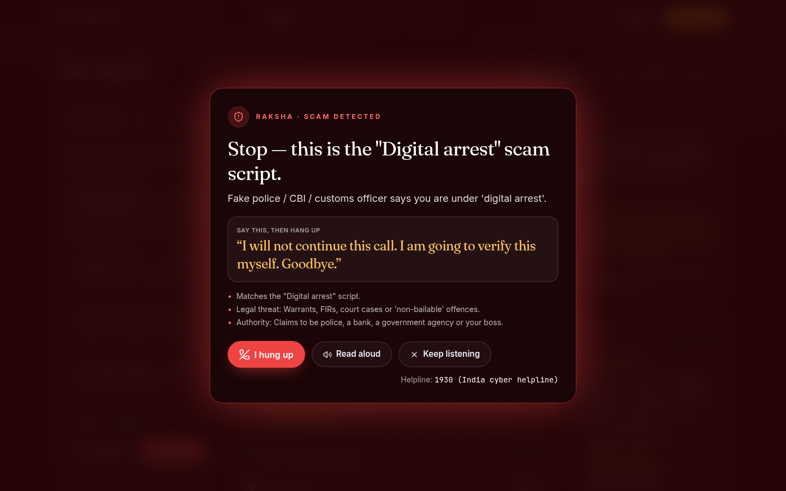
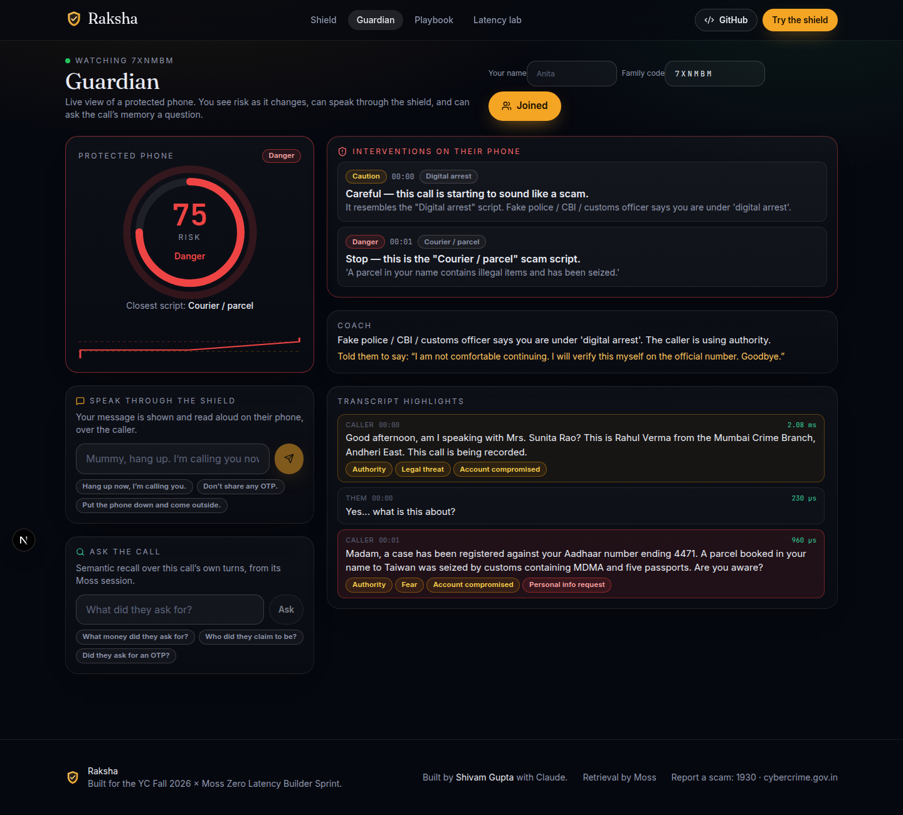
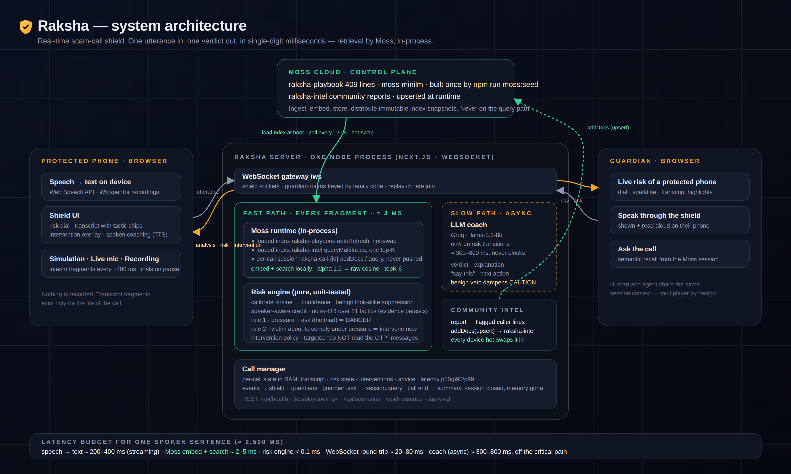

<p align="center">
  
</p>

<h1 align="center">Raksha — the real-time scam-call shield</h1>

<p align="center">
  <em>Every scam follows a script. Now your phone knows the script.</em><br/>
  Scam-script recognition in about 10 ms during a live call, powered by <a href="https://moss.dev">Moss</a>.
</p>

<p align="center">
  <a href="#quick-start">Quick start</a> ·
  <a href="docs/PRD.md">PRD</a> ·
  <a href="docs/ARCHITECTURE.md">Architecture</a> ·
  <a href="docs/eval/REPORT.md">Evaluation</a> ·
  <a href="docs/PRIVACY.md">Privacy</a> ·
  <a href="docs/VIDEO_SCRIPT.md">Video script</a> ·
  <a href="docs/DEVPOST.md">Submission</a>
</p>

---

Built for the **YC Fall 2026 × Moss: Zero Latency Builder Sprint** (theme: Real-Time Voice & Conversational AI, inspired by YC's *"Proving you're human"* and *"AI for the aging population"* requests). By **Shivam Gupta**, with Claude.

> **Deployed agent:** see the link in [docs/DEVPOST.md](docs/DEVPOST.md) (updated at submission).

**Measured on the committed evaluation (real Moss runtime, 18 scripted calls, 264 utterances, plus 80 everyday sentences):** 10/10 scam calls caught, 0/8 genuine calls flagged, 1/80 everyday sentences credited with any tactic, retrieval p50 9.3 ms / p95 18.4 ms including on-device embedding. See [docs/eval/REPORT.md](docs/eval/REPORT.md).

## The problem

Indians reported **₹22,845 crore** lost to cyber fraud in 2024 — ten times the figure two years earlier. "Digital arrest" alone took ~₹1,900 crore from 1.23 lakh people. In the US, phone calls carry the highest median loss of any scam channel, and 41% of the biggest losses by older adults began with a call. ([sources](docs/research/market-facts.md))

Every one of those calls followed a script: *authority → fear → secrecy → the ask*. Yet scam protection today is **number reputation** (Truecaller, Airtel, Jio, iOS call screening). By the time a number is flagged, the crew has a new one. The words never change. The only products that analyse what is actually *said* on a call ship on < 1% of Indian phones (Pixel 9+) or in the US only (Hiya, $9.99/month).

## What Raksha does

Raksha listens with you during a call and checks **every spoken fragment** against a playbook of real scam scripts. When pressure meets an ask, it interrupts — before the OTP leaves your mouth — tells you exactly what to say, and quietly alerts someone you trust.

| | |
|---|---|
|  |  |
| **The shield** stops a digital-arrest call mid-sentence: what script it is, one sentence to say, the helpline to call. | **The guardian** sees the risk of a parent's call live, speaks through the shield, and can ask the call's memory a question. |

* **Fast path (every fragment, ≈ 10 ms end-to-end, search < 1 ms):** Moss holds a 409-line scam playbook in memory. Each fragment is embedded and matched in-process — no vector database, no round-trip. A small, unit-tested risk engine credits persuasion tactics (authority, urgency, secrecy, the ask…) and a noisy-OR model decides *safe / caution / danger*.
* **Slow path (only on risk transitions):** an LLM coach explains in plain words, gives the exact sentence to say, and can veto a false alarm. It never sits on the critical path.
* **Circle of trust:** a family code links a phone to a guardian's dashboard. Human and agent share the same call session.
* **Community intel:** report a call and its flagged lines are upserted into a second Moss index; every running shield hot-swaps it in. New scam variants propagate without a redeploy.
* **Three ways to try it:** replay one of eighteen scripted calls (ten scams, eight genuine) with two synthetic voices, use your own microphone (phone on speaker), or upload a recording (transcribed by Whisper).
* **Privacy, precisely:** speech becomes text in the browser (Chrome uses Google's speech service, Safari transcribes on-device); the Raksha server receives text only, keeps it in RAM for the duration of the call, and discards it. Uploaded recordings go to Whisper on Groq for transcription and are not stored. Community reports are opt-in and contain only the caller's flagged lines.

## How Moss is used

| Moss capability | In Raksha |
|---|---|
| Loaded index, in-process query (`loadIndex`, `query`, `alpha: 1.0`) | The hot path. Raw cosine scores calibrated into tactic confidence. |
| Auto-refresh hot-swap (`autoRefresh`) | Playbook and community intel stay fresh with zero query downtime. |
| Sessions (`client.session`, `addDocs`, `query` + metadata filter, `deleteDocs`) | One local session per process holds every live call's turns tagged by call id; the guardian asks it questions; a call's turns are deleted at call end. Never pushed. |
| Multi-index search (`queryMultiIndex`) | Curated playbook + community intel, one global top-K. |
| Metadata filtering fields | `family`, `tactics`, `severity`, `kind` (tactic / benign look-alike), `stage`, `region`. |

Measured on the committed evaluation (18 full call transcripts): see [docs/eval/REPORT.md](docs/eval/REPORT.md) and `npm run eval:bench` (writes `docs/eval/latency.json` with hardware details). The **Latency lab** page benchmarks the running instance live.



Read the full [architecture document](docs/ARCHITECTURE.md).

## Quick start

```bash
git clone https://github.com/shi1720/YC-Fall-2026-x-Moss.git raksha && cd raksha
npm install
cp .env.example .env            # add MOSS_PROJECT_ID, MOSS_PROJECT_KEY, GROQ_API_KEY
npm run moss:seed               # builds the "raksha-playbook" index in Moss Cloud (once)
npm run dev                     # http://localhost:3000
```

Without Moss credentials the app still runs, on an offline lexical fallback (so CI and forks work) — the UI says so. Without a Groq key the coach uses templates.

| Script | What it does |
|---|---|
| `npm run dev` | Custom server (Next.js + WebSocket) with hot reload |
| `npm run build && npm start` | Production build and server (what the Docker image runs) |
| `npm run moss:seed [-- --reset]` | Create / upsert the playbook index from `data/playbook.json` |
| `npm run moss:status` | List indexes in the Moss project |
| `npm run eval` · `npm run eval:bench` | Replay all scenarios through the engine → `docs/eval/REPORT.md` · retrieval latency benchmark → `docs/eval/latency.json` |
| `npm test` · `npm run test:e2e` | Unit tests (vitest) · end-to-end (Playwright, offline runtime) |
| `npm run lint` · `npm run typecheck` | ESLint · `tsc --noEmit` |

### Environment

| Variable | Purpose |
|---|---|
| `MOSS_PROJECT_ID`, `MOSS_PROJECT_KEY` | Moss credentials (server only). From the [Moss portal](https://portal.usemoss.dev). |
| `MOSS_INDEX_PLAYBOOK`, `MOSS_INDEX_INTEL` | Index names (defaults `raksha-playbook`, `raksha-intel`). |
| `MOSS_REFRESH_SECONDS` | Auto-refresh polling interval (default 120). |
| `GROQ_API_KEY` | LLM coach + Whisper transcription (free tier). Any OpenAI-compatible endpoint works via `LLM_BASE_URL`, `LLM_API_KEY`, `LLM_MODEL`. |
| `RAKSHA_SCORE_FLOOR`, `RAKSHA_SCORE_CEIL`, `RAKSHA_ALPHA`, `RAKSHA_TOPK` | Retrieval calibration knobs (tuned by `npm run eval`). |

### Deploy

`Dockerfile` builds a single self-contained image (non-root, health-checked, ~300 MB RSS with the model loaded). `render.yaml` is a Render Blueprint for the free tier; `keepalive.yml` pings the deployed URL every 10 minutes so it never sleeps. Any Docker host works: set `MOSS_PROJECT_ID`, `MOSS_PROJECT_KEY`, `GROQ_API_KEY` and `PORT`.

## Repository

```
server/          custom Next.js + WebSocket server
src/app/         pages (/, /shield, /guardian, /playbook, /lab) and /api routes
src/lib/engine/  risk engine, call manager, retriever interface, offline fallback
src/lib/moss/    Moss runtime, retriever, community intel
src/lib/llm/     coach (provider-agnostic chat client)
data/            playbook.json (409 lines, 31 scam families), 18 scenario transcripts
scripts/         seed / status / eval / build
tests/           unit + e2e
docs/            PRD, architecture, privacy, evaluation, research, video script, deck
```

## Demo scripts (for judges)

* **60 seconds:** open `/shield?scenario=digital-arrest`, voices on, *Start the call*. Watch the dial, the tactic chips on each line, and the intervention at the first "ask". Click *Keep listening* to see the targeted "Do NOT transfer" warnings.
* **Multiplayer:** copy the guardian link from the shield page into a second window before starting. Send a message from the guardian; it is spoken on the shield. Ask "what money did they ask for?".
* **Latency:** open `/lab`, run 5 × 10 queries. Open `/playbook` and type anything a scammer might say.
* **Robustness:** run the *Genuine bank fraud call* or *Genuine courier delivery* scenario. They stay green: the bank says "we will never ask for your OTP", the courier asks for the app's delivery OTP at the door, and the benign look-alike lines in the index plus the benign-marker rules keep the shield quiet.

## Credits

Built by **Shivam Gupta** with Claude for the YC Fall 2026 × Moss Zero Latency Builder Sprint. Scam playbook lines are paraphrased from public advisories (I4C, RBI, TRAI, FTC, FBI IC3, Action Fraud, Scamwatch) and news reconstructions; they are not verbatim quotes of any victim's call. If you or someone you know is on such a call in India: hang up and call **1930** or report at [cybercrime.gov.in](https://cybercrime.gov.in).

License: MIT.
