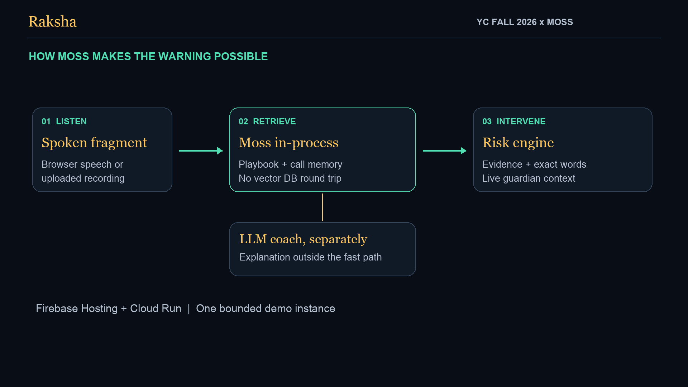

# Raksha architecture

Raksha is a browser-based scam-call decision aid. It analyses transcript fragments, explains recognised pressure tactics and connects the person with a trusted guardian. It does not intercept cellular calls or hang up for the person.

Live app: https://raksha-app.web.app

## Current deployment and retrieval status

The demo runs in one Google Cloud Run instance in `asia-south1`, with 2 CPU and 1 GiB RAM. Firebase Hosting provides the public URL and forwards HTTP. The browser reads `/api/config` and connects directly to Cloud Run for WebSockets because Firebase Hosting does not proxy that connection.

The real Moss runtime was verified on an earlier hosted revision. During final rollout on 16 September 2026, Moss Cloud returned credit-exhausted errors. The app therefore exposes a clearly labeled offline TF-IDF fallback and retries Moss recovery every 120 seconds. Fallback results and timings are not Moss benchmarks. Restoring credits on the configured Moss project is still required for the intended retrieval mode.

## Components

| Component | Responsibility |
|---|---|
| Next.js and React browser UI | Simulations, microphone/recording inputs, risk evidence, interventions and guardian controls |
| Custom Node.js HTTP server | Next.js pages, configuration, health, search, benchmark and transcription routes |
| WebSocket gateway (`server/ws.ts`) | Schema, payload and origin validation; phone and guardian event routing |
| Call manager (`src/lib/engine/calls.ts`) | Bounded call state, transcript, risk history, guardian replay and cleanup |
| Retriever interface (`src/lib/engine/retriever.ts`) | Separates Moss retrieval from the offline TF-IDF implementation |
| Moss runtime (`src/lib/moss/runtime.ts`) | Loads indexes, performs in-process queries, maintains call memory and handles recovery |
| Risk engine (`src/lib/engine/risk.ts`) | Combines tactic evidence into safe, caution or danger with explainable reasons |
| Coach (`src/lib/llm/coach.ts`) | Optional explanation; deterministic exit sentences and next steps remain authoritative |
| Community reporting (`src/lib/moss/intel.ts`) | Explicitly shared caller lines, duplicate suppression and reporting budget |

The custom server, WebSocket handlers, retrieval and call memory share one process. Credentials stay on the server. No distributed database, Redis layer or authenticated account system is implemented.

## Transcript-to-warning flow

1. The browser sends a scripted line, an interim/final speech-recognition fragment, or a segment from a transcribed recording.
2. The gateway validates the message and call context. The call manager enforces state and resource bounds.
3. Retrieval compares text against the 409-line playbook. Metadata describes tactic, family, severity and benign look-alikes.
4. The deterministic engine credits relevant tactics, accounts for the speaker and suppresses recognised benign look-alikes. Pressure combined with a request for money, codes, access or information can trigger danger. Compliance under pressure triggers a targeted intervention.
5. Risk, evidence and intervention events reach the protected browser and connected guardians.
6. Optional Groq coaching runs separately from detection. A provider failure leaves the deterministic warning and template guidance available.

Safe means no recognised concerning pattern was found. It does not verify the caller. Scripted fixtures are regression checks, not evidence of real-world fraud detection accuracy.

## Moss integration

| Capability | Use |
|---|---|
| Loaded index | `raksha-playbook` is loaded into process memory for local embedding and search |
| Metadata | Tactics and benign examples support interpretable scoring |
| Session memory | Transcript turns carry a call identifier; guardian questions query the relevant call |
| Multi-index retrieval | Optional `raksha-intel` reports can be searched with the curated playbook |
| Index refresh | Cloud updates can be loaded without rebuilding the application |

The offline retriever keeps demonstrations usable when Moss cannot load. Lexical matching is a different method and must not be presented as equivalent semantic retrieval. Community reporting and cloud index updates depend on Moss availability.

## Guardian access and state

A family-code link grants access to the associated calls. A guardian receives transcript/risk updates, can send a message to the shield and can search current-call context. Rejoining replays state without duplicate interventions. Ending a call prevents new utterances and guardian messages for that ended session.

Family codes are capability tokens, not authenticated identities or signed invitations. Share them only with trusted people. Stronger invitation and revocation controls are future work.

The deployment is capped at one instance because calls and guardian rooms are in RAM. A process restart loses that state. Horizontal scaling requires shared routing or cross-instance event/state handling before enabling more instances. That capability is not currently implemented.

## Data handling and controls

- Browser speech recognition may send audio to the browser vendor. Raksha receives transcript text in live mode.
- Uploaded recordings pass through the server to Groq transcription and are not written to disk by Raksha. Provider handling is governed by the provider's policies.
- Optional coaching sends relevant transcript context to the configured model provider.
- Completed records remain in RAM up to ten minutes for summary/reporting; call retrieval memory is cleaned up at call end.
- Community reporting requires an explicit action and shares flagged caller lines with Moss Cloud. Reports are separate from ephemeral call memory and should exclude personal information.
- Socket schemas, allowed origins, payload/rate bounds, upload validation, timeouts and process budgets limit malformed or excessive requests. These are not an independent security audit.

See [Privacy and threat model](PRIVACY.md).

## Validation and timing

Release verification includes 29 unit tests, 8 browser E2E tests against both a fresh local build and the hosted app, and 18 scripted calls covering 264 utterances. All 10 scam fixtures reached danger; none of the 8 genuine fixtures reached danger. Some genuine fixtures may reach caution.

Earlier real-Moss hosted evaluation recorded server-analysis p50 of 16.89 ms and p95 of 82.87 ms on the then-running 1-CPU revision with mixed test traffic. The final fallback evaluation recorded p50 of 0.58 ms and p95 of 2.13 ms. These differ in environment and retrieval mode. They are not a direct performance comparison or latency guarantee. Server analysis also differs from retrieval-only latency and browser round-trip time.

The live latency lab identifies the engine and separates measurement categories. Real acoustic microphone quality across devices, languages and accents was not validated by this release pass.

Evidence: [release verification](submission/verification.md), [real-Moss evaluation](submission/hosted-moss-evaluation.json), [fallback evaluation](submission/hosted-fallback-evaluation.json), [judge testing instructions](submission/testing.md).

## Next engineering steps

Restore Moss credits; evaluate consented conversations beyond fixtures; add signed guardian invitations and report moderation; design shared routing/state before scaling; test speech services and languages on real devices. Native phone integration and fully on-device operation are separate future projects.
