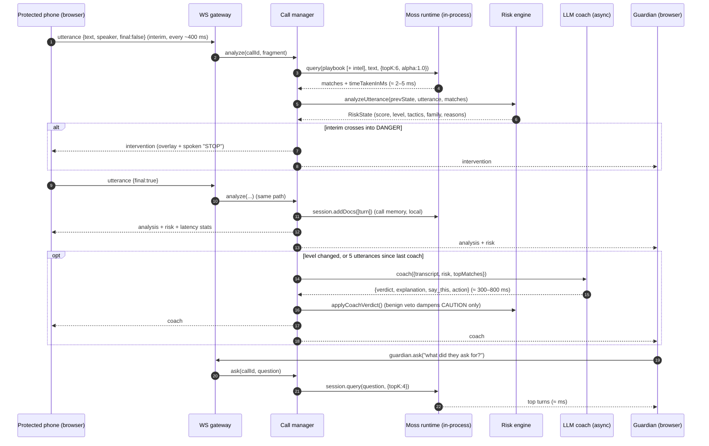

# Raksha — Architecture

> One utterance in, one verdict out, in single-digit milliseconds. This document explains how the pieces fit, why the retrieval layer sits where it does, and what the latency budget looks like.


## 1. The shape of the problem

A phone scam is a *conversation with a script*. The words change per family (digital arrest, bank OTP, courier parcel, deepfake CFO…) but the arc is constant: **pretext → pressure → isolation → the ask**. The victim is put into an emotional state where judgement shuts down (AARP calls it "the ether"), and the whole con is won or lost in the few seconds around the ask: *"read me the six digits, quickly."*

That fixes three design constraints:

1. **Every fragment must be checked, not every sentence.** By the time a sentence has ended, the OTP may have been read out. We analyse interim speech-recognition fragments every ~400 ms as well as final segments.
2. **The check must cost nothing.** Hundreds of fragments per call, thousands of concurrent calls: a per-fragment cloud round-trip or LLM call is both too slow and too expensive. Local Moss queries are unmetered.
3. **The verdict must be explainable to a frightened 70-year-old, in one sentence, with one thing to say.**

Hence a **fast path** (Moss + a small deterministic risk engine, on every fragment) and a **slow path** (an LLM coach, only on risk transitions).

## 2. Components

| Component | Where | Responsibility |
|---|---|---|
| Speech → text | Browser (Web Speech API), or Groq Whisper for recordings | Streams interim + final fragments. Nothing is stored. |
| Shield UI | Browser (`/shield`) | Risk dial, transcript with tactic chips, playbook matches, coach card, full-screen intervention with spoken coaching. Modes: simulation (scripted call with two TTS voices), live microphone, uploaded recording. |
| WebSocket gateway | `server/ws.ts` | One socket per protected phone or guardian. Routes utterances in, fans engine events out. Guardian rooms keyed by family code, with state replay on late join. |
| Call manager | `src/lib/engine/calls.ts` | Per-call state in RAM: transcript, `RiskState`, interventions, coach advice, latency percentiles. Owns the per-call Moss session. |
| **Moss runtime** | `src/lib/moss/runtime.ts` | Loads `raksha-playbook` (and `raksha-intel` when it exists) into the process at boot with `autoRefresh`; opens a `SessionIndex` per call; answers every query in-process. |
| Retriever abstraction | `src/lib/engine/retriever.ts` | `Retriever` interface with two implementations: `MossRetriever` (production) and `MockRetriever` (TF-IDF cosine, zero credentials, used by CI). |
| Risk engine | `src/lib/engine/risk.ts` | Pure functions, unit-tested. Turns retrieval hits into a 0–100 score and a level (safe / caution / danger). |
| LLM coach | `src/lib/llm/coach.ts` | OpenAI-compatible chat call (Groq by default) returning `{verdict, explanation, say_this, action}`. Template fallback when no key is configured. |
| Community intel | `src/lib/moss/intel.ts` | On consent, upserts a call's flagged caller lines into `raksha-intel`; every running instance hot-swaps the new version in. |
| Eval harness | `scripts/eval.ts` | Replays nine scripted calls through the real engine and writes `docs/eval/REPORT.md`. |

Everything runs in **one Node process** (custom Next.js server + `ws`). That is deliberate: the Moss runtime, the loaded indexes and the per-call sessions must live in the same memory as the WebSocket handlers. It also means one container, one URL, no infrastructure.

## 3. The life of one utterance



## 4. The risk model

The engine is intentionally small and inspectable (see `src/lib/engine/risk.ts`, 100% covered by `tests/unit/risk.test.ts`).

**Calibration.** Moss is queried with `alpha: 1.0` so scores are raw cosine similarities and comparable across queries. A score is mapped to a confidence with a linear ramp between a floor (noise) and a ceiling (near-paraphrase): `RAKSHA_SCORE_FLOOR` / `RAKSHA_SCORE_CEIL`, tuned by the eval harness.

**Crediting.** For one fragment we take the top hits, apply benign suppression (if a *legitimate look-alike* line scores as high as the best tactic line, the fragment is ignored — this is how *"we will never ask for your OTP"* stays quiet), apply a rank discount (the top hit is what the fragment *is*; the rest is what it *resembles*), and make it speaker-aware: the protected person's own words can only ever be evidence of **compliance** (reading an OTP, agreeing to transfer), never of the caller's pressure tactics — and vice-versa.

**Accumulating.** Each of 21 tactics keeps the best confidence seen in the call (evidence persists; a scam does not un-happen because the caller went quiet). The base score is a noisy-OR:

```
score = 100 · (1 − Π_t (1 − w_t · cap · conf_t))
```

so one strong tactic alone tops out around 30 (a bank *does* say "this is the bank"), while several distinct tactics compound quickly. Two hard rules mirror how scams actually end:

* **The triad.** A *pressure* tactic (authority, fear, urgency, secrecy, isolation, legal threat, hold-the-line…) plus an *ask* (OTP, payment, remote access, personal info) ⇒ at least **DANGER**.
* **Victim compliance.** If the person starts reading out a code or says "I'm transferring now" while any pressure tactic is active ⇒ score ≥ 85 and an immediate, targeted intervention (*"Do NOT read out the OTP."*).

Levels: safe < 25 ≤ caution < 60 ≤ danger. The dominant scam family is the one with the largest confidence mass, with hysteresis so the label does not flip between sibling scripts (courier parcel → digital arrest) every turn.

**Slow path veto.** A confident *benign* verdict from the coach halves a CAUTION score. It never overrides DANGER: by then the triad has fired and the cost of a miss is someone's savings.

## 5. Where Moss does real work

| Capability | How Raksha uses it | Why it matters |
|---|---|---|
| **Loaded cloud index** (`loadIndex`, `query`) | `raksha-playbook` (409 lines) loaded at boot, queried for every fragment with raw cosine scores. | The entire hot path is in-process: no vector DB, no network, ~3 ms. |
| **Auto-refresh with hot-swap** (`autoRefresh`, `pollingIntervalInSeconds`) | Both indexes poll every 120 s; newer versions swap in with zero query downtime. | New scam variants reach every running shield without a redeploy. |
| **Sessions** (`client.session`, `addDocs`, `query`) | One `SessionIndex` per call holds the call's own turns. The guardian's "ask the call" is a semantic query over it. | Live-call context with no persistence: memory dies with the call unless the user reports it. |
| **Multi-index search** (`queryMultiIndex`) | Playbook + community intel searched in one call for a single global top-K. | Curated and crowd-sourced knowledge without merging indexes. |
| **Metadata** | Every line carries `family`, `tactics`, `severity`, `kind` (tactic / benign), `stage`, `region`. | The engine reasons over tactics, not raw text; benign look-alikes live in the same index. |
| **Server-side embedding on ingest** (`createIndex`, `addDocs` upsert) | Seeding and community reports embed in Moss Cloud. | The API routes never need the model in memory. |

Not used, on purpose: `pushIndex` (call memory must not persist by default), and the browser/WASM SDK for the hot path (its current release cannot use a delegated authenticator, so the project key would have to ship to the browser; the interface in `retriever.ts` is designed so the hot path can move on-device the day that lands).

## 6. Latency budget

For one spoken sentence (~2.5 s at conversational pace):

| Stage | Typical | On the critical path? |
|---|---|---|
| Speech → text (streaming interim) | 200–400 ms | yes (platform-bound) |
| WebSocket hop | 20–80 ms | yes |
| **Moss embed + search** | **2–5 ms** | yes |
| Risk engine | < 0.1 ms | yes |
| LLM coach | 300–800 ms | **no** — async, on transitions only |

The `Latency lab` page measures the Moss numbers live against the running instance; `docs/eval/REPORT.md` records them for the committed evaluation.

## 7. Deployment

* **Image:** `Dockerfile` (multi-stage, Node 22, non-root, health-check). `npm run build` produces the Next.js build and `dist/server.mjs` (esbuild bundle of the custom server).
* **Host:** any Docker host; the reference deployment is a Hugging Face Space (free tier, 16 GB RAM, port 7860). `.github/workflows/sync-to-hf.yml` mirrors `main` to the Space; `keepalive.yml` pings `/api/health` every 30 minutes so judges never hit a cold start.
* **State:** none outside the process except the Moss Cloud indexes. `MOSS_MODEL_CACHE_DIR` keeps the embedding model on the container's disk between restarts.
* **Config:** see `.env.example`. Without Moss credentials the app runs on the offline lexical fallback (so CI and forks work); without a Groq key the coach uses templates.

## 8. Security & privacy

* Audio never leaves the device in live mode; the server receives text fragments only, holds them in RAM for the duration of the call, and discards them at call end.
* Recordings uploaded in "Recording" mode are streamed to Whisper and not stored.
* Community reporting is opt-in per call and shares only the *caller's* flagged lines, never the protected person's words.
* The Moss project key lives on the server only. Family codes are capability tokens with no personal data behind them.
* No accounts, no cookies, no analytics.

## 9. Repository map

```
server/            custom Next.js + WebSocket server (ws.ts routes, index.ts boot)
src/app/           pages: / shield guardian playbook lab, and /api/* route handlers
src/lib/engine/    types, risk engine, call manager, retriever interface, mock retriever, latency
src/lib/moss/      Moss runtime (loading, sessions), MossRetriever, community intel
src/lib/llm/       provider-agnostic chat client, coach prompts
src/lib/data/      playbook codec, family + tactic catalogue
data/              playbook.json (409 lines), transcripts/ (9 scenarios)
scripts/           seed-moss, moss-status, eval, build-server
tests/             unit (vitest) and e2e (Playwright)
docs/              PRD, this document, eval report, research, video script, deck
```
